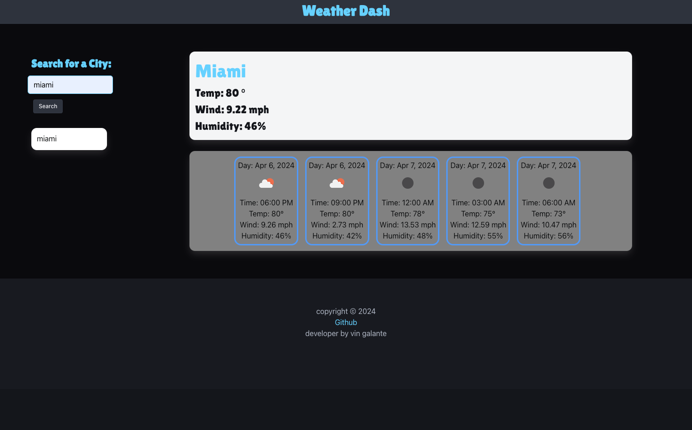

## Description

Weather Dash is a dynamic weather application that provides real-time weather information and forecasts. Users can search for cities globally to get current weather conditions, including temperature, wind speed, and humidity, as well as a five-day forecast. The app also features a search history function, allowing users to quickly access previous searches.

## Visuals

## Deployment

LIVE DEMO: ([Visit Live >](https://vgalante2.github.io/Weather_App/))

## Usage

To use the webpage, you can review each section by clicking on the header links at the top of the page. To inspect each element, you can open the Chrome DevTools by pressing Command+Option+I (macOS) or Control+Shift+I (Windows). A console panel should open either below or to the side of the webpage in the browser. There you can navigate to the Accessibility tab to highlight each picture element,

## Credits

- https://openweathermap.org/ API

## License

MIT License. All rights reserved.
